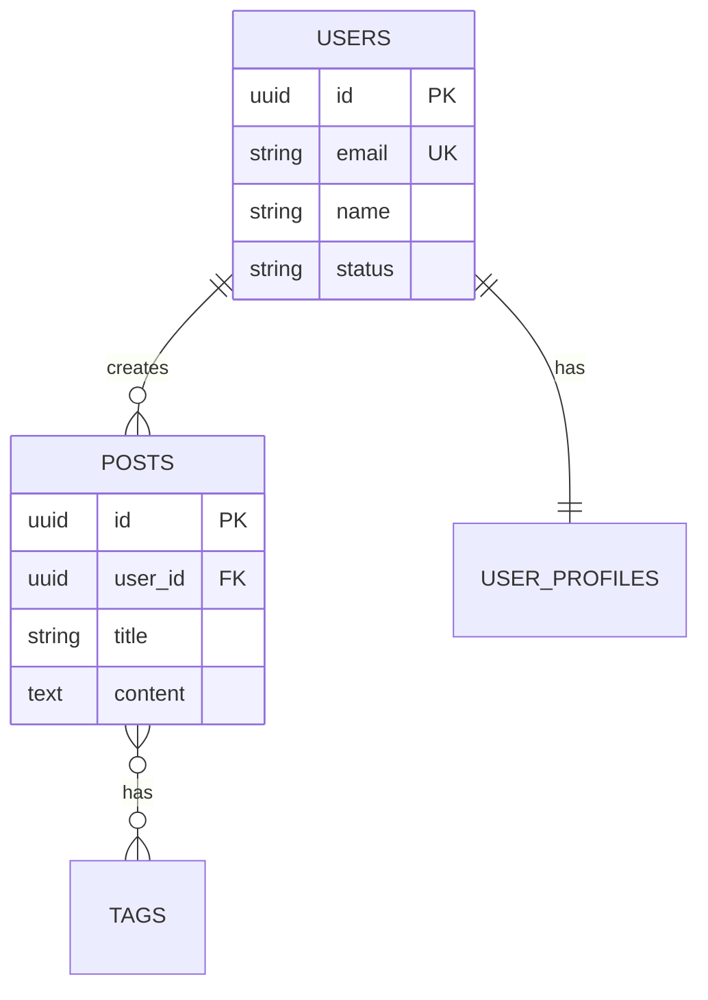

# Database Schema Designer

## Purpose

Design robust, scalable database schemas. Create efficient queries, migrations, and indexing strategies. Provide guidance on normalization, denormalization, and performance optimization across SQL and NoSQL databases.

---

## Activation Triggers

Use this skill when the user:
- Needs to "design a database" or "create a schema"
- Wants to "normalize" or "denormalize" data
- Needs help with "database migrations"
- Asks about "indexing" or "query optimization"
- Wants to "write SQL queries"
- Needs "MongoDB schema design"
- Asks about "database relationships"

---

## Supported Databases

### SQL (Relational)
- **PostgreSQL** (recommended)
- MySQL/MariaDB
- SQLite
- SQL Server
- Oracle

### NoSQL
- **MongoDB** (document)
- Redis (key-value)
- Cassandra (wide-column)
- Neo4j (graph)
- DynamoDB (key-value/document)

---

## Execution Workflow

### Phase 1: Requirements Analysis

**Step 1.1: Understand Data Requirements**

```
Gather:
- What entities/objects need to be stored?
- What are the relationships between them?
- What queries will be most common?
- What's the expected data volume?
- Read-heavy or write-heavy workload?
- Consistency vs availability requirements?
```

**Step 1.2: Choose Database Type**

| Requirement | Recommendation |
|-------------|----------------|
| Complex relationships | SQL (PostgreSQL) |
| Flexible schema | MongoDB |
| High write throughput | Cassandra, DynamoDB |
| Graph relationships | Neo4j |
| Caching/sessions | Redis |
| Transactions required | SQL |

**Step 1.3: Define Data Model**

```
For each entity, identify:
□ Primary key strategy (UUID, auto-increment, composite)
□ Required vs optional fields
□ Data types and constraints
□ Relationships (1:1, 1:N, N:M)
□ Indexes needed
□ Audit fields (created_at, updated_at)
```

---

### Phase 2: Schema Design (SQL)

**Step 2.1: Basic Table Structure**

```sql
-- PostgreSQL example

-- Users table
CREATE TABLE users (
    id UUID PRIMARY KEY DEFAULT gen_random_uuid(),
    email VARCHAR(255) NOT NULL UNIQUE,
    password_hash VARCHAR(255) NOT NULL,
    name VARCHAR(100) NOT NULL,
    status VARCHAR(20) NOT NULL DEFAULT 'active'
        CHECK (status IN ('active', 'inactive', 'suspended')),
    role VARCHAR(20) NOT NULL DEFAULT 'member'
        CHECK (role IN ('admin', 'member', 'guest')),
    email_verified_at TIMESTAMPTZ,
    last_login_at TIMESTAMPTZ,
    created_at TIMESTAMPTZ NOT NULL DEFAULT NOW(),
    updated_at TIMESTAMPTZ NOT NULL DEFAULT NOW()
);

-- Add index for common queries
CREATE INDEX idx_users_email ON users(email);
CREATE INDEX idx_users_status ON users(status);

-- Add trigger for updated_at
CREATE OR REPLACE FUNCTION update_updated_at()
RETURNS TRIGGER AS $$
BEGIN
    NEW.updated_at = NOW();
    RETURN NEW;
END;
$$ LANGUAGE plpgsql;

CREATE TRIGGER users_updated_at
    BEFORE UPDATE ON users
    FOR EACH ROW
    EXECUTE FUNCTION update_updated_at();
```

**Step 2.2: Relationship Patterns**

**One-to-Many (1:N):**
```sql
-- A user has many posts
CREATE TABLE posts (
    id UUID PRIMARY KEY DEFAULT gen_random_uuid(),
    user_id UUID NOT NULL REFERENCES users(id) ON DELETE CASCADE,
    title VARCHAR(255) NOT NULL,
    content TEXT,
    status VARCHAR(20) NOT NULL DEFAULT 'draft',
    published_at TIMESTAMPTZ,
    created_at TIMESTAMPTZ NOT NULL DEFAULT NOW(),
    updated_at TIMESTAMPTZ NOT NULL DEFAULT NOW()
);

CREATE INDEX idx_posts_user_id ON posts(user_id);
CREATE INDEX idx_posts_status ON posts(status);
CREATE INDEX idx_posts_published_at ON posts(published_at DESC);
```

**Many-to-Many (N:M):**
```sql
-- Posts have many tags, tags have many posts
CREATE TABLE tags (
    id UUID PRIMARY KEY DEFAULT gen_random_uuid(),
    name VARCHAR(50) NOT NULL UNIQUE,
    slug VARCHAR(50) NOT NULL UNIQUE,
    created_at TIMESTAMPTZ NOT NULL DEFAULT NOW()
);

-- Junction table
CREATE TABLE post_tags (
    post_id UUID NOT NULL REFERENCES posts(id) ON DELETE CASCADE,
    tag_id UUID NOT NULL REFERENCES tags(id) ON DELETE CASCADE,
    created_at TIMESTAMPTZ NOT NULL DEFAULT NOW(),
    PRIMARY KEY (post_id, tag_id)
);

CREATE INDEX idx_post_tags_tag_id ON post_tags(tag_id);
```

**One-to-One (1:1):**
```sql
-- User has one profile (optional extended info)
CREATE TABLE user_profiles (
    user_id UUID PRIMARY KEY REFERENCES users(id) ON DELETE CASCADE,
    bio TEXT,
    avatar_url VARCHAR(500),
    website VARCHAR(255),
    location VARCHAR(100),
    settings JSONB DEFAULT '{}',
    created_at TIMESTAMPTZ NOT NULL DEFAULT NOW(),
    updated_at TIMESTAMPTZ NOT NULL DEFAULT NOW()
);
```

**Self-Referential:**
```sql
-- Categories with parent/child hierarchy
CREATE TABLE categories (
    id UUID PRIMARY KEY DEFAULT gen_random_uuid(),
    parent_id UUID REFERENCES categories(id) ON DELETE SET NULL,
    name VARCHAR(100) NOT NULL,
    slug VARCHAR(100) NOT NULL,
    depth INTEGER NOT NULL DEFAULT 0,
    path TEXT[], -- Materialized path for efficient queries
    created_at TIMESTAMPTZ NOT NULL DEFAULT NOW(),
    UNIQUE(parent_id, slug)
);

CREATE INDEX idx_categories_parent_id ON categories(parent_id);
CREATE INDEX idx_categories_path ON categories USING GIN(path);
```

---

### Phase 3: Normalization

**Step 3.1: Normalization Forms**

**1NF (First Normal Form):**
- Each column contains atomic values
- No repeating groups

```sql
-- BAD: Repeating groups
CREATE TABLE orders_bad (
    id INT,
    item1 VARCHAR(100),
    item2 VARCHAR(100),
    item3 VARCHAR(100)  -- What if 4 items?
);

-- GOOD: Separate table
CREATE TABLE orders (
    id UUID PRIMARY KEY
);

CREATE TABLE order_items (
    id UUID PRIMARY KEY,
    order_id UUID REFERENCES orders(id),
    product_name VARCHAR(100),
    quantity INT
);
```

**2NF (Second Normal Form):**
- 1NF + no partial dependencies on composite key

```sql
-- BAD: Partial dependency
CREATE TABLE order_items_bad (
    order_id UUID,
    product_id UUID,
    product_name VARCHAR(100),  -- Depends only on product_id
    quantity INT,
    PRIMARY KEY (order_id, product_id)
);

-- GOOD: Separate product details
CREATE TABLE products (
    id UUID PRIMARY KEY,
    name VARCHAR(100)
);

CREATE TABLE order_items (
    order_id UUID REFERENCES orders(id),
    product_id UUID REFERENCES products(id),
    quantity INT,
    PRIMARY KEY (order_id, product_id)
);
```

**3NF (Third Normal Form):**
- 2NF + no transitive dependencies

```sql
-- BAD: Transitive dependency
CREATE TABLE employees_bad (
    id UUID PRIMARY KEY,
    department_id UUID,
    department_name VARCHAR(100),  -- Depends on department_id
    department_budget DECIMAL      -- Depends on department_id
);

-- GOOD: Separate department table
CREATE TABLE departments (
    id UUID PRIMARY KEY,
    name VARCHAR(100),
    budget DECIMAL
);

CREATE TABLE employees (
    id UUID PRIMARY KEY,
    department_id UUID REFERENCES departments(id)
);
```

**Step 3.2: When to Denormalize**

Denormalization is appropriate when:
- Read performance is critical
- Data rarely changes
- Complex joins are causing bottlenecks
- Reporting/analytics use cases

```sql
-- Denormalized for read performance
CREATE TABLE order_summaries (
    order_id UUID PRIMARY KEY REFERENCES orders(id),
    customer_name VARCHAR(100),      -- Copied from customers
    customer_email VARCHAR(255),     -- Copied from customers
    total_items INT,
    total_amount DECIMAL(10,2),
    status VARCHAR(20),
    created_at TIMESTAMPTZ
);

-- Keep in sync with triggers or application logic
```

---

### Phase 4: Indexing Strategy

**Step 4.1: Index Types**

```sql
-- B-tree (default, most common)
CREATE INDEX idx_users_email ON users(email);

-- Hash (equality only, not range)
CREATE INDEX idx_users_id_hash ON users USING HASH(id);

-- GIN (arrays, JSONB, full-text)
CREATE INDEX idx_profiles_settings ON user_profiles USING GIN(settings);

-- GiST (geometric, full-text)
CREATE INDEX idx_locations_point ON locations USING GIST(coordinates);

-- Partial index (filtered)
CREATE INDEX idx_active_users ON users(email) WHERE status = 'active';

-- Composite index
CREATE INDEX idx_posts_user_status ON posts(user_id, status);

-- Covering index (includes additional columns)
CREATE INDEX idx_posts_list ON posts(user_id, status) INCLUDE (title, created_at);
```

**Step 4.2: Index Selection Guidelines**

| Query Pattern | Index Type |
|---------------|------------|
| Equality (=) | B-tree or Hash |
| Range (<, >, BETWEEN) | B-tree |
| Sorting (ORDER BY) | B-tree |
| LIKE 'prefix%' | B-tree |
| LIKE '%suffix' | GIN with trigrams |
| Array contains | GIN |
| JSONB queries | GIN |
| Full-text search | GIN or GiST |

**Step 4.3: Index Anti-Patterns**

```sql
-- BAD: Over-indexing
-- Don't add indexes you won't use

-- BAD: Indexing low-cardinality columns alone
CREATE INDEX idx_status ON users(status);  -- Only 3 values

-- BETTER: Combine with high-cardinality column
CREATE INDEX idx_status_created ON users(status, created_at);

-- BAD: Wrong column order in composite index
CREATE INDEX idx_wrong ON orders(status, user_id);
-- Query: WHERE user_id = ? AND status = ?
-- Should be: (user_id, status) for best selectivity first
```

---

### Phase 5: Query Optimization

**Step 5.1: EXPLAIN ANALYZE**

```sql
-- Always check query plans
EXPLAIN ANALYZE
SELECT u.name, COUNT(p.id) as post_count
FROM users u
LEFT JOIN posts p ON p.user_id = u.id
WHERE u.status = 'active'
GROUP BY u.id
ORDER BY post_count DESC
LIMIT 10;
```

**Step 5.2: Common Optimizations**

```sql
-- Avoid SELECT *
-- BAD
SELECT * FROM users WHERE id = ?;
-- GOOD
SELECT id, email, name FROM users WHERE id = ?;

-- Use EXISTS instead of IN for subqueries
-- BAD
SELECT * FROM users WHERE id IN (SELECT user_id FROM orders);
-- GOOD
SELECT * FROM users u WHERE EXISTS (
    SELECT 1 FROM orders o WHERE o.user_id = u.id
);

-- Avoid functions on indexed columns
-- BAD (can't use index)
SELECT * FROM users WHERE LOWER(email) = 'john@example.com';
-- GOOD (use expression index or store lowercase)
CREATE INDEX idx_users_email_lower ON users(LOWER(email));

-- Use LIMIT with ORDER BY
SELECT * FROM posts
ORDER BY created_at DESC
LIMIT 20;

-- Pagination with cursor (better than OFFSET)
SELECT * FROM posts
WHERE created_at < ?  -- cursor from previous page
ORDER BY created_at DESC
LIMIT 20;
```

**Step 5.3: N+1 Query Prevention**

```sql
-- BAD: N+1 queries
-- 1. SELECT * FROM users
-- 2. SELECT * FROM posts WHERE user_id = 1
-- 3. SELECT * FROM posts WHERE user_id = 2
-- ... N more queries

-- GOOD: Single query with JOIN
SELECT u.*, p.*
FROM users u
LEFT JOIN posts p ON p.user_id = u.id
WHERE u.status = 'active';

-- GOOD: Two queries (fetch all then assemble)
SELECT * FROM users WHERE status = 'active';
SELECT * FROM posts WHERE user_id IN (?, ?, ?);
```

---

### Phase 6: NoSQL Schema Design (MongoDB)

**Step 6.1: Document Structure**

```javascript
// User document
{
  _id: ObjectId("..."),
  email: "john@example.com",
  passwordHash: "...",
  name: "John Doe",
  status: "active",
  role: "member",
  profile: {  // Embedded document (1:1)
    bio: "...",
    avatarUrl: "...",
    settings: {
      notifications: true,
      theme: "dark"
    }
  },
  createdAt: ISODate("2024-01-15T10:30:00Z"),
  updatedAt: ISODate("2024-01-15T10:30:00Z")
}
```

**Step 6.2: Embedding vs Referencing**

**Embed when:**
- Data is always accessed together
- Child data is bounded (small array)
- Updates are infrequent

```javascript
// Embed: Order with line items
{
  _id: ObjectId("..."),
  userId: ObjectId("..."),
  items: [  // Embedded array
    { productId: ObjectId("..."), name: "Widget", quantity: 2, price: 9.99 },
    { productId: ObjectId("..."), name: "Gadget", quantity: 1, price: 19.99 }
  ],
  total: 39.97,
  status: "completed"
}
```

**Reference when:**
- Data is accessed independently
- Child data is unbounded (large arrays)
- Many-to-many relationships

```javascript
// Reference: User with posts
// users collection
{ _id: ObjectId("user1"), name: "John" }

// posts collection
{ _id: ObjectId("post1"), userId: ObjectId("user1"), title: "..." }
{ _id: ObjectId("post2"), userId: ObjectId("user1"), title: "..." }
```

**Step 6.3: MongoDB Indexes**

```javascript
// Single field index
db.users.createIndex({ email: 1 });

// Compound index
db.posts.createIndex({ userId: 1, createdAt: -1 });

// Text index for search
db.posts.createIndex({ title: "text", content: "text" });

// TTL index (auto-delete after time)
db.sessions.createIndex({ createdAt: 1 }, { expireAfterSeconds: 3600 });

// Unique index
db.users.createIndex({ email: 1 }, { unique: true });

// Partial index
db.users.createIndex(
  { email: 1 },
  { partialFilterExpression: { status: "active" } }
);
```

---

### Phase 7: Migrations

**Step 7.1: Migration File Template**

```sql
-- migrations/20240115_create_users.sql

-- Up Migration
CREATE TABLE users (
    id UUID PRIMARY KEY DEFAULT gen_random_uuid(),
    email VARCHAR(255) NOT NULL UNIQUE,
    name VARCHAR(100) NOT NULL,
    created_at TIMESTAMPTZ NOT NULL DEFAULT NOW()
);

-- Down Migration
DROP TABLE IF EXISTS users;
```

**Step 7.2: Safe Migration Patterns**

```sql
-- Adding a column (safe)
ALTER TABLE users ADD COLUMN phone VARCHAR(20);

-- Adding NOT NULL column (requires default or backfill)
ALTER TABLE users ADD COLUMN status VARCHAR(20) NOT NULL DEFAULT 'active';

-- Renaming column (use new + migrate + drop old)
-- Step 1: Add new column
ALTER TABLE users ADD COLUMN full_name VARCHAR(100);
-- Step 2: Backfill data
UPDATE users SET full_name = name;
-- Step 3: Application uses both columns
-- Step 4: Drop old column
ALTER TABLE users DROP COLUMN name;

-- Adding index concurrently (no locks)
CREATE INDEX CONCURRENTLY idx_users_phone ON users(phone);
```

**Step 7.3: Dangerous Operations**

```sql
-- DANGEROUS: Locks table
ALTER TABLE large_table ADD COLUMN new_col VARCHAR(50) NOT NULL;

-- SAFER: Add nullable first, then backfill, then add constraint
ALTER TABLE large_table ADD COLUMN new_col VARCHAR(50);
UPDATE large_table SET new_col = 'default' WHERE new_col IS NULL;
ALTER TABLE large_table ALTER COLUMN new_col SET NOT NULL;

-- DANGEROUS: Rebuilds entire index
CREATE INDEX idx_name ON large_table(column);

-- SAFER: Concurrent index creation
CREATE INDEX CONCURRENTLY idx_name ON large_table(column);
```

---

### Phase 8: Output Formats

**SQL Schema Script:**
```sql
-- Complete database schema

-- Extensions
CREATE EXTENSION IF NOT EXISTS "uuid-ossp";

-- Tables
CREATE TABLE ...

-- Indexes
CREATE INDEX ...

-- Triggers
CREATE TRIGGER ...

-- Views (if needed)
CREATE VIEW ...
```

**ER Diagram (Mermaid):**


---

## Quality Checklist

### Schema Design
- [ ] Primary keys defined
- [ ] Foreign keys with appropriate ON DELETE
- [ ] NOT NULL where required
- [ ] Constraints (CHECK, UNIQUE) in place
- [ ] Appropriate data types

### Performance
- [ ] Indexes for common queries
- [ ] No over-indexing
- [ ] Composite indexes in correct order
- [ ] Explain analyze reviewed

### Maintainability
- [ ] Consistent naming conventions
- [ ] Audit fields (created_at, updated_at)
- [ ] Comments on complex logic
- [ ] Migration scripts safe

---

## Integration with Other Skills

### With api-documentation-generator:
- Document database-backed API schemas
- Create data model documentation

### With code-review-assistant:
- Review SQL queries for performance
- Check for SQL injection risks

### With technical-writer:
- Create database documentation
- Write migration guides

---

## Version History

- v1.0.0 (2025-12-07): Initial release with SQL schema design, normalization, indexing, MongoDB patterns, and migration guidance
